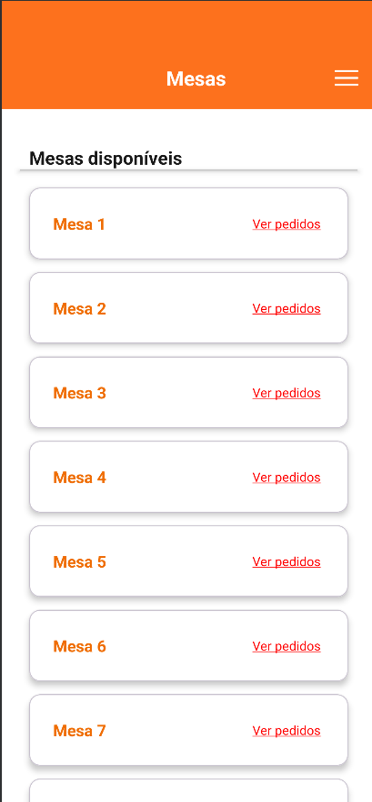
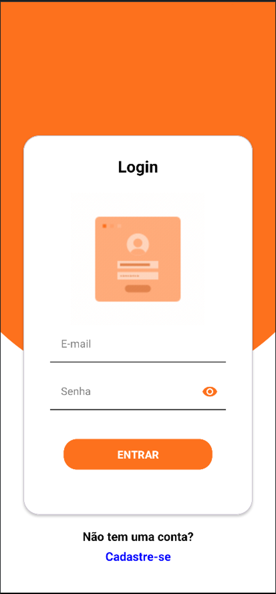

# Rango

## About this app

This is a digital menu that you implement in your restaurant (or something like that) to make some
manual processes more digital.
In this case, this app can be used to send orders to kitchen, calculate tables payment and show tables historic.

My idea is to automate as much of all restaurant process as possible.

___

### Features:

 * **Menu:** you can see all menu sections and items.

   
 * **Order:** You can see all items in your order, choose a table and submit to kitchen.
*    

 * **Tables:** You can see all orders of all tables, and close their accounts..
 *   
   
 * **Sign in, Sign up and Sign out.**
 *   
___

### Future features:

* **Multi usages:** At this moment this app can be used for only one restaurant.
I want to make this app usable for as many restaurants as possible. For this, i need to create a restaurant register.
Each restaurant can be create your own menu, table, employees account, administrator account...

* **Dishes register:** At this moment i need to access firebase realtime database to register any new item to menu, i want to create a screen to insert new items to menu.

* **Category register:** Each dishe need at least one category (drinks, dessert...), and i need to create a feature to register new dishes categories.

* **Search dishes:** Creation of a feature to search menu items by name, category...

* **Search tables:** A feature to search tables.

* **Dark Mode**
___

## About this software

This is a native Android software with kotlin language and MVVM architecture. I use firebase to all my external needs, like: authentication service, online database, crash reports...

### Technologies
* [Architecture](https://developer.android.com/topic/architecture)
* [Kotlin language](https://kotlinlang.org/)
* [View Binding](https://developer.android.com/topic/libraries/view-binding)
* [Navigation](https://developer.android.com/guide/navigation)
* [Hilt - dependency injection](https://developer.android.com/training/dependency-injection/hilt-android)
* [Preferences data store - local data store](https://developer.android.com/topic/libraries/architecture/datastore)
* [Firebase - Realtime database, crashlytics, analytics, authentication and distribution](https://firebase.google.com/)
* [Material - Official Android design](https://m3.material.io/)
* [Livedata](https://developer.android.com/topic/libraries/architecture/livedata)


### Device Support
At this moment this software is supported by more than 90% of current devices.
```
minSdk = 28      // Android 9 (Pie)
targetSdk = 34   // Android 14 (Upside down cake)
```
___

### Data flow
I'm using MVVM architecture, so my app basically contains 3 layers:

**View >> ViewModel >> Repository**

**View << ViewModel << Repository**

* **View:** UI elements that render the data on the screen..
* **ViewModel:** State holders (that hold data, expose it to the UI, and handle logic).
* **Repository:** Data Layer (call external or internal services to return any data).


Also, i'm using a **single activity architecture**, i's means that my software has only one activity.
This activity contains a fragment container view where i inflate all my fragments.

I prefer to use this methodology because it's most simple to control app navigation, global events and
it's avoids to much bureaucracy (activity declaration on manifest, for example)


____

## Run this project:

### IDE
After clone this project you'll need to use [Android Studio IDE](https://developer.android.com/studio). At this moment i'm using this version:
```
Android Studio Jellyfish | 2023.3.1
Build #AI-233.14808.21.2331.11709847, built on April 12, 2024


Runtime version: 17.0.10+0--11572160 amd64
VM: OpenJDK 64-Bit Server VM by JetBrains s.r.o.
```

If you're using the newest version, probably can't find any software support problem.

### Build Variants
This software contains 2 different build flavors and 2 build types:

**Build types:**
**_debug_**:  Disable software shrink and ofuscate code and enable debug mode (better solution for tests and developing time).
**_release_**: Enable software shrink and ofuscate code and disable debug mode (better solution to see release version).

```
buildTypes {
        release {
            isMinifyEnabled = true
            isShrinkResources = true
            isDebuggable = false
            proguardFiles(
                getDefaultProguardFile("proguard-android-optimize.txt"),
                "proguard-rules.pro"
            )
            signingConfig = signingConfigs.getByName("release")
        }

        debug {
            isMinifyEnabled = false
            isShrinkResources = false
            isDebuggable = true
        }
    }
```

**Build Flavor**
**_develop_**: Just change app name, add package suffix and version name suffix (ideal for internal tests).
**_prod_**: This is production flavor.

```
productFlavors {
        create("develop") {
            dimension = "version"
            applicationIdSuffix = ".dev"
            versionNameSuffix = "-dev"
            resValue("string", "app_name", "[Dev] Rango")

            buildConfigField("String", "APP_NAME", "\"Rango.dev/\"")
        }
        create("prod") {
            dimension = "version"
            resValue("string", "app_name", "Rango")

            buildConfigField("String", "APP_NAME", "\"Rango/\"")
        }
    }
```

Use build **_developDebug_** during development and tests.

Use build **_developRelease_** to distribute internal testings.

Use build **_prodDebug_** to production tests and hotfix (if you have differents databases or API keys).

Use build **_prodRelease_** to distribute production version.


_Note: I don't have different databases or different API keys for these flavors, but I decided to separate them, perhaps for future implementations._


### Firebase setup:
This project use [Firebase realtime database](https://firebase.google.com/docs/database) to fetch and send data, so to run this project you need to setup a firebase project and register your app, follow this step-by-step:

**OBS: YOU DON'T NEED TO INSERT ANY DEPENDENCY IN YOUR PROJECT build.gradle.** 

* **_Create a firebase project: Go to firebase website >> sign in with yout Google Account >> Go to console >> New project_**
  * Insert project name and follow firebase steps.
  * On your project dashboard, select **_Add App_** >> **_Android App_**
  * Insert this data on creation form: **_Package Name:_** _com.example.rango_ *(**MANDATORY**) >> **_Nickname:_** _Rango_ (this is your app name on firebase), then follow firebase steps.
  * Now on your firebase project dashboard, select **_Add App_** >> **_Android App_** again (now you create a project to develop flavor).
  * Insert this data on creation form: **_Package Name:_** _com.example.rango.dev_ *(**MANDATORY**) >> **_Nickname:_** _[Dev] Rango_, then follow firebase steps.
  * After create 2 android projects (Rango and [Dev] Rango), go to firebase **PROJECT SETTINGS** and inside **Your Apps** sections, select **_google-services.json_** to download a json file.
  * Copy and past this **_google-services.json_** inside path **app**: **_android_project/app/google-services.json_**.
  * Now you can run this app with your own firebase project.
 
### Realtime Database Setup:
I using this firebase service to save and fetch data, but you need to insert some models in your database.
These models are inside this project inside models path models.

Your database need to have three base directories: **categories, dishes and tables**.
if you have no patience register some models only for test yout app, like this:


**REMEMBER TO SET DEFAULT TEST RULES TO YOUR DATABASE:**
```
{
  "rules": {
    ".read": true,
    ".write": true
  }
}
```
____

### Use

After do all this setups, you can run your app and create new orders.

Basically, it's important see firebase database when you're using the app, because this app insert, delete and fetch data.

When you create one order, you can see this order on **DATABASE orders** directory.
When you go to tables, the software fetch this table and show you the Tables that contains orders. You can see and close orders.
When you close an order, this order is removed of **orders** directory and a new model is inserted on **closed_orders** table.
____

Last update: 06/30/2024
